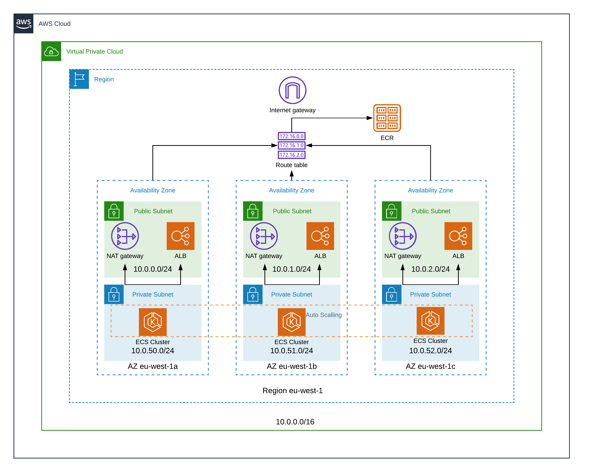

# AWS ECS


## ECS infrastructure

ECS needs EC2 nodes that are being used as slaves to run Docker containers on. To do so you need infrastructure for this. Here is an ECS production-ready infrastructure diagram.



What are we creating:

* VPC with a /16 ip address range and an internet gateway
* We are choosing a region and a number of availability zones we want to use. For high-availability we need at least two
* In every availability zone we are creating a private and a public subnet with a /24 ip address range
  * Public subnet convention is 10.x.0.x, 10.x.1.x, 10.x.2.x etc..
  * Private subnet convention is 10.x.50.x, 10.x.51.x, 10.x.52.x etc..
* In the public subnet we place a NAT gateway and the LoadBalancer
* The private subnets are used in the autoscale group which places instances in them
* We create an ECS cluster where the instances connect to

## Terraform module

To be able to create the stated infrastructure we are using Terraform. To allow everyone to use the infrastructure code, this repository contains the code as Terraform modules so it can be easily used by others.

Creating one big module does not really give a benefit of modules. Therefore the ECS module itself consists of different modules. This way it is easier for others to make changes, swap modules or use pieces from this repository even if not setting up ECS.

Details regarding how a module works or why it is setup is described in the module itself if needed.

Modules need to be used to create infrastructure. For an example on how to use the modules to create a working ECS cluster see **main.tf** and **[ENV]_parameters.tfvars**.

**Note:** You need to use Terraform version 0.11.14

### Conventions

These are the conventions we have in every module

* Contains main.tf where all the terraform code is
* If main.tf is too big we create more *.tf files with proper names
* [Optional] Contains outputs.tf with the output parameters
* [Optional] Contains variables.tf which sets required attributes
* For grouping in AWS we set the tag "Environment" everywhere where possible

## Create it

To create a working ECS cluster from this repository see **main.tf** and **[ENV]_parameters.tfvars**.


Actual way for creating everything using the default terraform flow:

```bash
aws configure

terraform init
terraform plan -input=false -var-file=dev_parameters.tfvars
terraform apply -input=false -var-file=dev_parameters.tfvars
```